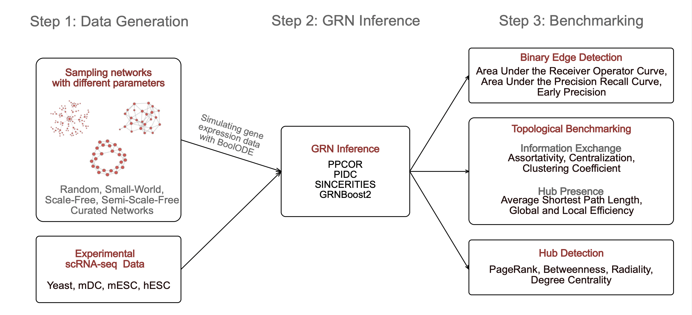

# STREAMLINE: Structural and Topological Performance Analysis of Algorithms for the Inference of Gene Regulatory Networks from Single-Cell Transcriptomic Data

STREAMLINE is a refined benchmarking strategy for GRN Inference Algorithms that focuses on the preservation of topological graph properties as well as the identification of hubs. This repository contains all the necessary files that are necessary to perform the analysis. The implementation is compatible with BEELINE. We suggest to set up BEELINE first and then proceed with the steps described below. The preprint that contains our findings and can be used as citation can be found [here](https://www.biorxiv.org/content/10.1101/2022.10.31.514493v1).

## Step 1: Network Sampline
The folder "network sampling" contains the Julia code that was used to sample the parameter controlled artifical ground truth networks. The exact values of the parameters can be chosen by the user. After the networks sampleing the output can be translated to input files for BoolODE, which can be used to sample the transcriptomic data.

## Step 2: GRN Inference
The second step involves the inference of the gene regulatory networks using the data generated in step 1. The computations can be performed as required by the algorithm that should be benchmarked.

## Step 3: Benchmarking
The benchmarking scripts are implemented as an extension to BEELINE. The files contained in the folder have to be stored as described in the [developer guide for BEELINE](https://murali-group.github.io/Beeline/BEELINE.html#adding-a-new-evaluation-technique) and then can be triggered within the pipeline. However, the analysis can be performed outside of BEELINE as well by extracting the relevant methods. 
